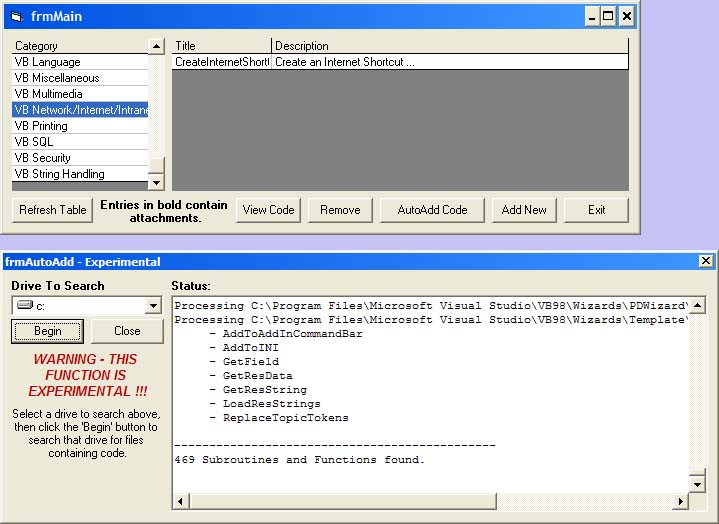



## UPDATED: Code Library with Auto Add Feature

### Description

About a year ago, I submitted a code library, which was pretty basic. My first submission, etc.

One of the comments I received was the wish for an automatic code addition function. I have finally found the time to make that addition.

This version of my code library has a much different interface, supports attachments as well as snippets, and also includes AUTOMATIC ADDITION OF SNIPPETS on your hard drive.

The program searches for .BAS files on the specified drive, then looks in each .BAS file it finds for Functions and Subs, which are added to the back-end Access database.

Further, snippets can be added singly, by clicking the 'Add Snip From File' button on the Add New form (frmAddNew).

Be forewarned - this code is not yet complete; I've yet to work the GUI, and commenting is sparse. And no, I am not an expert programmer. This is just a hobby for me!
 
### More Info
 
UPDATE: I've added to the AutoAdd function. It now grabs the declarations for that module. I haven't got it down to grabbing the required modules. Rather, it grabs them all, and stores them with the snip.

Also, since PSC has been having problems with ZIP downloading (due to the hurricane), I've placed the ZIP file on my test server: http://derekw.dynu.net/codelib.zip

Thanks for the ratings, everyone. Wasn't expecting to get any response!

             |
---                |---
**Submitted On**   |2004-09-08 11:30:26
**By**             |[FortyPoundHead](https://github.com/Planet-Source-Code/PSCIndex/blob/master/ByAuthor/fortypoundhead.md)
**Level**          |Intermediate
**User Rating**    |4.4 (31 globes from 7 users)
**Compatibility**  |VB 6\.0
**Category**       |[Miscellaneous](https://github.com/Planet-Source-Code/PSCIndex/blob/master/ByCategory/miscellaneous__1-1.md)
**World**          |[Visual Basic](https://github.com/Planet-Source-Code/PSCIndex/blob/master/ByWorld/visual-basic.md)
**Archive File**   |[Code\_Libra179081982004\.zip](https://github.com/Planet-Source-Code/fortypoundhead-updated-code-library-with-auto-add-feature__1-56044/archive/master.zip)

